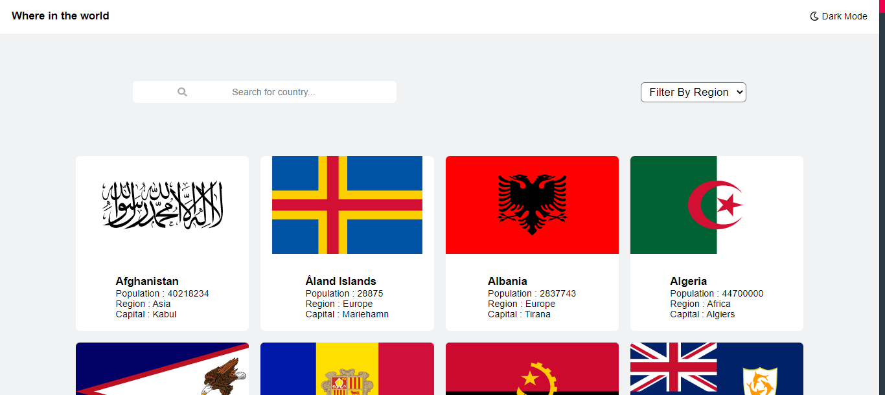
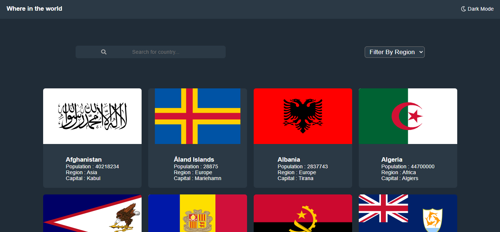
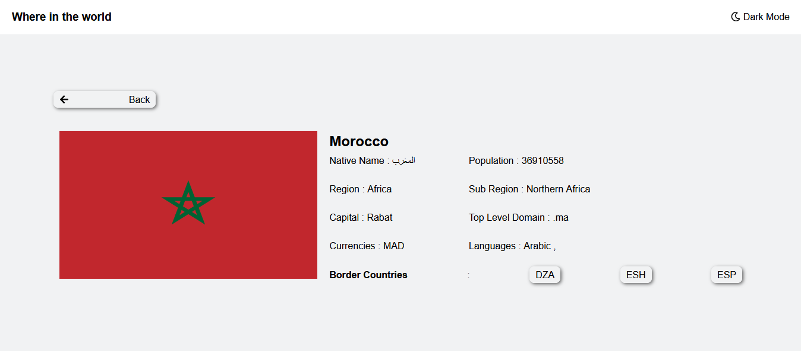
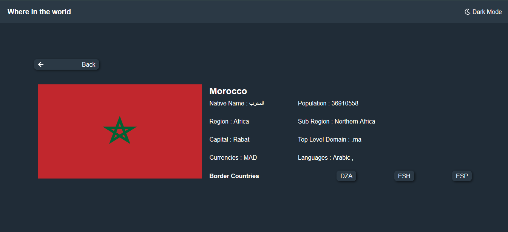

<h1 style="color:#f98f36;">Coutries Projects</h1>

It a project build with React ; and it about project that allow the user to search throw a display of coutries and he can get some information about the country that he click on it

<h2 ><strong style="color:#f98f36;">Api that i used : </strong>https://restcountries.com/v2/all</h2>
 
<h3> <strong style="color:#f98f36;">Live view Of the website : </strong>https://i-countries.netlify.app/</h3>
 
<h2 style="color:#f98f36;">Some Pictures of the project</h2>

